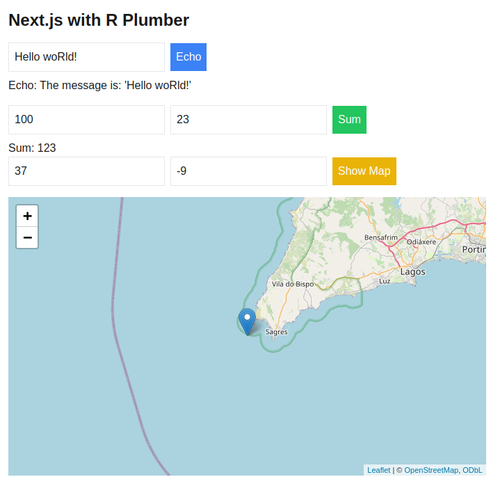

# Next.js with R Plumber

This project demonstrates a Next.js application with TypeScript, that interacts with an R Plumber backend.




## Prerequisites

- Docker
- Docker Compose


## Getting Started

1. Clone the repository:
   ```
   git clone https://github.com/aTnT/plumber-nextjs-app.git
   cd plumber-nextjs-app
   ```

2. Build and run the Docker containers:
   ```
   docker-compose up --build
   ```

3. Access the application:
   - Frontend available at `http://localhost:3000`
   - Running swagger Docs at http://localhost:8000/__docs__/
   - Running plumber API at `http://localhost:8000`


## Contributing

Contributions are welcome! Please feel free to submit a Pull Request.

